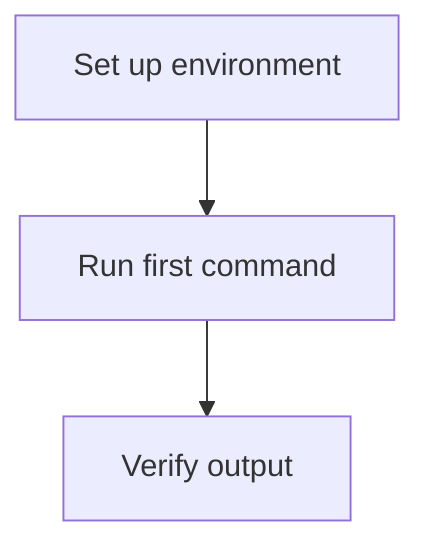

# Blog Post Generator — Context for Claude Code

This project converts Zoom meeting transcripts (.vtt files) into blog post drafts.

## Meeting context

- **Groups:** Researchers at various levels (postdocs, faculty, staff) — the specific group varies by event
- **Format:** Informal discussion workshops or seminars, typically 60–120 minutes, multiple speakers
- **Theme:** AI and LLMs in research and academic workflows — always substantive and hands-on
- **Recurring topics across events:**
  - AI/agentic coding for scientific research
  - Model comparisons (Claude, Gemini, GPT) in research workflows
  - Practical failures and lessons learned using LLMs
  - AI ethics in research contexts
  - Interdisciplinary applications (astrophysics, health communication, etc.)
  - Doing research with Claude Code & other models
  - What's new in AI?
  - Preparing for careers in academia and tech
  - How best to teach AI
  - Best practices in using AI
- **Audience:** Researchers and academics interested in AI in science — accessible but substantive, no hype
- **Tailor the intro and framing** to the specific group/event when the user provides context (e.g. "faculty workshop", "postdoc meetup", "cross-department seminar")

## Header level rules (applies to all post formats)

Choose header depth based on the weight of the content — do not default to H2 for everything:

- **`## H2`** — a major topic that dominated a significant portion of the session and stands fully on its own (e.g. a tool demo, a core debate, a framework introduced). Use 2–4 per post.
- **`### H3`** — a sub-topic that belongs under a parent H2 but is substantial enough to name (e.g. a specific use case, a speaker's distinct contribution, a counterpoint explored in depth). Use only when the H2 has genuine sub-structure.
- **No header** — a brief observation, transition, or minor point that flows naturally from the previous paragraph. Don't create a heading for one or two sentences.
- **Rule of thumb:** if removing the header and folding the content into the previous paragraph reads just as well, skip it. Headers signal a meaningful shift in topic, not paragraph breaks.

---

## Post format A — Discussion recap (default for recurring meetups)

Use this format for informal multi-speaker discussion sessions (e.g. AI Fellow Meetup) where speaker identity cannot be reliably determined from the transcript.

- **Length:** 750–1250 words
- **Structure:**
  1. `# Title` — punchy and specific
  2. Intro paragraph (2–3 sentences — what was discussed and why it matters)
  3. `## Key Takeaways` — 4–7 bullets, each a single crisp actionable or insightful sentence
  4. Narrative sections following the arc of the discussion (see header rules above)
  5. Closing 2–3 paragraphs — what the session signals for the field, what the group might explore next
- **Tone:** Conversational but intellectually serious — write for a smart colleague, not a press release
- **Do NOT quote or attribute** any statement to a named speaker — speaker identity cannot be reliably determined. Write in third person ("the group discussed…", "one perspective raised was…")
- **Do NOT invent or embellish** content not present in the transcript or PDFs
- Strip filler words, crosstalk, and repetition — surface the actual ideas
- **PDF/slide content:** use to add precision or context to what the transcript discusses — do not repeat slide text verbatim

---

## Post format B — Structured event / seminar recap

Use this format for one-off structured events (e.g. invited talks, faculty workshops, multi-speaker seminars) where speakers are identifiable by name from the slides or agenda PDF.

- **Length:** 1000–1500 words (can go longer if the event warrants it)
- **Purpose:** brand the session and its content for researchers; serve as a replicable prototype for similar events in other departments
- **Structure:**
  1. `# Title` — specific to the event theme, not generic
  2. `## About This Session` — 2–3 sentences: what was the aim, who organised it, who participated (use names/affiliations from the PDF if available). Think of this as the "why this happened" paragraph.
  3. `## How the Session Was Structured` — brief description of the session format (e.g. lightning talks → open discussion, panel format, hands-on demo). This is a workflow map for readers who want to replicate it, not a minute-by-minute log. Keep it to a short paragraph or a simple list.
  4. `## Key Takeaways` — 4–7 bullets, each a single crisp actionable or insightful sentence drawn from across all speakers
  5. Speaker/topic sections — the main body. Each section covers one speaker's contribution or one major topic block:
     - Use the speaker's name (from the PDF/slides) as the `## H2` header when a section is anchored to one person's talk: `## Jane Smith — Using LLMs for Literature Review`
     - Use a topic-based `## H2` when a section covers group discussion or a topic not tied to a single speaker
     - Use `### H3` for sub-points within a speaker's section if their talk covered distinct threads
     - Do not force every speaker into equal length — allocate space proportional to substance
  6. Closing paragraph (1–2 paragraphs) — reflect on the session as a whole: what it signals, what it makes possible, how it could be replicated or extended
- **Speaker attribution:** use names and affiliations exactly as they appear in the slides/agenda PDF — do not infer names from the audio transcript alone
- **Tone:** Accessible and energising — this post should make a reader want to attend the next one or run their own version
- **Do NOT invent or embellish** content not present in the transcript or PDFs

---

## Post format C — Single-author tutorial

Use this format for a single-presenter, step-by-step tutorial or how-to session (~1 hour) with a clear skeleton — the kind of session that works well as a beginner-friendly walkthrough. Slides are optional but helpful for structure and diagrams.

- **Length:** 1000–1800 words
- **Purpose:** preserve the tutorial's clear structure so readers can follow along without watching the recording
- **Structure:**
  1. `# Title` — specific to what the tutorial teaches, not generic
  2. Intro paragraph (2–3 sentences: what the tutorial covers, who it's for, any prerequisites)
  3. `## What You'll Learn` — 4–7 bullets, each a single crisp outcome
  4. **Overview Mermaid diagram** — a flowchart or sequence diagram of the whole tutorial flow, placed immediately after "What You'll Learn". This is the skeleton that makes the post valuable to beginners.
  5. Sequential `## H2` sections following the tutorial's steps in order (see header rules above)
     - Use `### H3` for sub-steps within a major step when the presenter broke a step into distinct parts
     - Include fenced code blocks for commands, snippets, or config the presenter demonstrated
     - Add a per-section Mermaid diagram when a step has meaningful sub-structure (e.g. a branching workflow, a multi-stage pipeline)
  6. Closing paragraph (1–2 paragraphs) — recap what was covered, suggested next steps, links or resources mentioned in the session
- **Speaker attribution:** attribute to the named presenter throughout ("In this tutorial, [Name] walks through…"). Use the presenter's name and affiliation from slides/PDF if available, or from user-provided context. Do not infer the presenter's name from the audio transcript alone.
- **Tone:** Clear and instructional — write for someone who wants to reproduce the workflow, not just understand the ideas
- **Do NOT invent or embellish** content not present in the transcript or PDFs
- **PDF/slide content:** use slides to recover section order, step labels, and diagram structure — do not repeat slide text verbatim

### Mermaid diagram rules (Format C)

Diagrams are authored as fenced code blocks with the `mermaid` language tag. The blog renders them via Mermaid.js.

```markdown

```

Follow these syntax rules so diagrams render correctly:

- **No spaces in node IDs** — use camelCase or underscores (`stepOne`, `verify_output`)
- **Quote labels with special characters** — `A["Step 1: Install"]` not `A[Step 1: Install]`
- **Avoid reserved IDs** — do not use `end`, `subgraph`, `graph` as node IDs
- **No custom colors or styling** — the blog theme handles appearance
- **Keep diagrams focused** — one diagram per logical unit; prefer a single overview diagram plus 1–2 section diagrams over many small ones
- **Match the session's skeleton** — the overview diagram should mirror the slide outline or the presenter's stated structure

## Event folder structure

All events live under:

```
~/Dropbox/DDDI/Events/
```

Two folder patterns exist:

**Single-event folders** (new style — theme + date in folder name):
```
~/Dropbox/DDDI/Events/<Theme-Date>/
    GMT<date>-<time>_Recording.transcript.vtt
    <optional-slides>.pdf
```
Example:
```
~/Dropbox/DDDI/Events/Scientific-research-with-AI-tools-May-7/
    GMT20260507-180041_Recording.transcript.vtt
    Research-with-AI-slides.pdf
```

**Series sub-folders** (AI Fellow Meetup recurring series):
```
~/Dropbox/DDDI/Events/AI-Fellow-Meetup/<Date>/
    GMT<date>-<time>_Recording.transcript.vtt
```
Example:
```
~/Dropbox/DDDI/Events/AI-Fellow-Meetup/Mar19, 2026/
    GMT20260319-200425_Recording.transcript.vtt
```

Use `list_events()` to see all available events and their files before resolving paths.

## Standard workflow

### Single transcript — Format A (discussion recap)

When asked to generate a discussion-style blog post from one meeting:

1. Use `list_events()` if you need to confirm the event folder name or find the VTT path
2. Use **`parse_transcript(vtt_path)`** — pass either the full VTT path **or the event folder path** (the tool auto-discovers the VTT and any PDFs in the same folder)
   - ⚠️ **NEVER read VTT or PDF files directly.** Always use `parse_transcript` — it compresses and structures the content before passing it to you. Bypassing it loads raw unprocessed files that are too large to work with.
3. Read the clean transcript (and any supplementary PDF content) carefully for main themes, chronological flow, and concrete takeaways
4. Write the draft using **Post format A** — no speaker attribution, third-person narrative
5. Use `save_draft` — always pass `meeting_date` (ISO format, e.g. `"2026-05-07"`) extracted from the VTT filename. Use a descriptive `filename` if the user specifies one.
6. Tell the user where the draft was saved and suggest 1–2 edits they might want to make

### Single transcript — Format B (structured event recap)

When asked to generate a branded/structured recap of a one-off seminar or workshop:

1. Use `list_events()` if needed, then **`parse_transcript(vtt_path)`** with the event folder path
   - ⚠️ **NEVER read the VTT or PDF files directly** (with Read or any other tool). Always go through `parse_transcript` — it handles stop-word compression, speaker merging, and PDF extraction. Reading raw files bypasses all preprocessing and will flood context with ~20k+ unprocessed words.
2. **From the PDF section of the tool output:** extract speaker names, affiliations, session agenda, and talk order — this is the authoritative source for attribution
3. **From the transcript section:** fill in the substance of each talk and the discussion — match what was said to who said it using the PDF's talk order as a guide
4. Write the draft using **Post format B** — speaker-attributed sections, session framing, replication-oriented tone
5. Use `save_draft` with `meeting_date` extracted from the VTT filename. Use a descriptive `filename` (e.g. `"2026-05-07-scientific-research-ai-tools.md"`)
6. Tell the user where the draft was saved and suggest 1–2 edits

### Single transcript — Format C (single-author tutorial)

When asked to generate a tutorial-style blog post from a single-presenter session:

1. Use `list_events()` if needed, then **`parse_transcript(vtt_path)`** with the event folder path
   - ⚠️ **NEVER read the VTT or PDF files directly.** Always use `parse_transcript` — it auto-discovers the VTT and any slide PDFs in the same folder.
2. **From the PDF/slides (if present):** extract the presenter's name, affiliation, section outline, and any diagram structure — this is the authoritative source for attribution and skeleton
3. **From the transcript:** follow the tutorial chronologically, capturing each step, commands shown, and explanations — match steps to the slide outline when available
4. Write the draft using **Post format C** — named presenter, step-by-step structure, overview Mermaid diagram, code blocks where demonstrated
5. Use `save_draft` with `meeting_date` extracted from the VTT filename. Use a descriptive `filename` (e.g. `"2026-06-15-claude-code-tutorial.md"`)
6. Tell the user where the draft was saved and suggest 1–2 edits (e.g. verify diagram accuracy against slides, add presenter photo before publishing)

### Two transcripts

When asked to generate a blog post from two meetings (e.g. "Mar 19 and Mar 20"):

1. Use `parse_transcript(vtt_path, vtt_path2)` with both paths — the tool returns both transcripts (plus any PDFs) labeled by date
2. Read both and **map topics across dates**:
   - List topics from Date1
   - List topics from Date2
   - Mark which topics appear in both (overlap) vs. unique to each
3. **Content rule — treat it like a set union:**
   - Include Date1 content in full
   - From Date2, include **only topics not already covered in Date1** (Date2 \ Date1). If a topic appears in both dates, use the richer/more detailed discussion and drop the duplicate — do NOT summarize it twice
   - If the same topic evolved or deepened between sessions, you may note the progression briefly
4. **Length distribution:** divide the target word count proportionally by unique content, not mechanically 50/50
5. **Intro:** note that this post draws from discussions across both [Date1] and [Date2] sessions
6. **Takeaways list:** draw from both dates, deduplicating any that are semantically identical
7. Use `save_draft` with `meeting_date` set to the earlier date and a descriptive `filename` that reflects the combined scope (e.g. `"2026-03-19-2026-03-20-agentic-tools.md"`)

## Publishing workflow

When asked to publish a draft to the blog:

1. Use `publish_to_blog` tool with:
   - `draft_filename`: the file in `drafts/` (e.g. `"2026-05-07-draft.md"`)
   - `post_slug`: short URL-friendly slug from the title (e.g. `"ai-tools-scientific-research"`)
   - `post_title`: the H1 title from the draft
   - `post_subtitle`: subtitle if present in the draft
   - `summary`: 1–2 sentence summary for the homepage card
   - `meeting_date`: ISO date extracted from the VTT filename (e.g. `"2026-05-07"`)
   - Adjust `author_name` / `author_title` if the user specifies a different group (e.g. faculty workshop vs. postdoc meetup); otherwise leave as defaults
   - **Format C (tutorial):** set `author_name`, `author_title`, and `author_pic` to the named presenter (e.g. `author_name="Jane Smith"`, `author_title="Postdoctoral Researcher, UPenn Physics"`, `author_pic="/assets/images/authors/jane-smith.png"`). Remind the user to add the presenter photo to `assets/images/authors/` if it doesn't exist yet.
2. The tool creates branch `post/YYYY-MM-DD-slug` in `~/DDDI_DP_Blog`, writes the post with Jekyll frontmatter, pushes, and opens a draft PR at `github.com/dddiscovery/datapoints`
3. Tell the user the PR URL and remind them to:
   - Edit the post in Cursor on the new branch
   - Add a cover image to `assets/images/posts/`
   - Update `index.md` homepage `featured_posts` if this post should be featured
   - Mark the PR as ready and merge to `main` when done
4. Example calling:
> "Publish the draft for Scientific-research-with-AI-tools-May-7 to the blog."

> "Publish the draft 2026-05-07-scientific-research-ai-tools.md to the blog with slug ai-tools-scientific-research and author title 'Faculty, UPenn Physics'."

> "Publish the draft 2026-06-15-claude-code-tutorial.md with slug claude-code-tutorial, author_name 'Jane Smith', author_title 'Postdoctoral Researcher, UPenn Physics'."

## Prompt flow for common requests

### Format A — Discussion recap (AI Fellow Meetup)
> "Generate a blog post from the AI Fellow Meetup on Mar 19."

Claude uses Format A (no speaker names, third-person narrative).

> "Generate a blog post combining the Mar 19 and Mar 20 AI Fellow Meetup sessions."

Claude uses Format A with the two-transcript union logic.

### Format B — Structured event recap
> "Generate a structured event recap for Scientific-research-with-AI-tools-May-7."

or

> "Draft a Format B post for Scientific-research-with-AI-tools-May-7."

Claude uses Format B: reads the PDF for speaker names/agenda first, then fills in substance from the transcript. Saves as `2026-05-07-scientific-research-ai-tools.md`.

### Format C — Single-author tutorial
> "Generate a tutorial recap for the Claude Code workshop on Jun 15."

or

> "Draft a Format C post for the event folder Intro-to-agentic-coding-Jun-15."

Claude uses Format C: reads slides for section outline and presenter name, follows the tutorial steps from the transcript, includes Mermaid overview diagram. Saves as `2026-06-15-claude-code-tutorial.md`.

**Optional modifiers:**
- `"...~1200 words"` — target length
- `"...the audience was faculty from CS and life sciences"` — tailors framing
- `"...save it as scientific-research-ai-may7.md"` — custom filename

### How Claude picks the format if you don't specify
- Single presenter / tutorial / how-to / walkthrough framing → defaults to **Format C**
- Event folder contains a PDF with an agenda/speaker list (multi-speaker) → defaults to **Format B**
- AI Fellow Meetup series, no agenda PDF → defaults to **Format A**
- When ambiguous, Claude asks before writing
